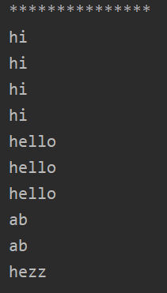

Воронов Вадим ИБ-119
# Лабораторная работа 7.
## Сортировка массива по частоте элементов.
В хеш таблицу сохраняются пары: хеш элемента(ключ) - частота(значение).
При вызове метода sort в классе HashSort сначала идёт подсчет частоты элементов в массиве(countItems) с сохранением значений в таблицу, а после сортировка вставками с помощью полученных значений.
Классс ComparableString создавался с целью сравнения строк (если какие-либо элементы имеют одинаковую частоту).

### Пример вывода программы:
Входные данные: "hi ab hezz hello hello hi hi hi ab hello"

